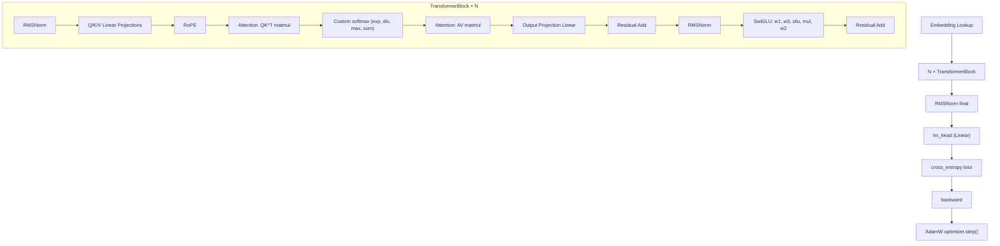

# Q1

分析一下这几个kernel占用cpu时间最多的合理性

# A1

---

## 各 CUDA Kernel 占用 GPU 时间最多的合理性分析

根据你的 write-up 中的 profiling 结果，我来逐一分析它们为什么合理。

### 一、模型计算流程回顾

每个 step 的计算路径为：

---

### 二、Forward 最耗时 Kernel 分析

#### Small 模型：`ampere_sgemm_64x32_sliced1x4_tn`
#### Large 模型：`ampere_sgemm_128x64_tn`

**这两个都是 cuBLAS 的 SGEMM（单精度矩阵乘法）kernel**，完全合理。原因如下：

**Forward 中的所有矩阵乘法调用点**（每个 TransformerBlock）：

| 操作 | 来源 | 矩阵形状 |
|------|------|----------|
| Q projection | `self.q_proj(x)` = `einsum(x, weight)` | (seq, d_model) × (d_model, d_model) |
| K projection | `self.k_proj(x)` | 同上 |
| V projection | `self.v_proj(x)` | 同上 |
| Attention QK^T | `einsum(Q, K, "... query d_k, ... key d_k -> ... query key")` | (seq, d_k) × (d_k, seq) |
| Attention AV | `einsum(attn_weights, V, "... query key, ... key d_v -> ... query d_v")` | (seq, seq) × (seq, d_v) |
| Output projection | `self.output_proj(attn_output)` | (seq, d_model) × (d_model, d_model) |
| FFN w1 | `self.w1(x)` | (seq, d_model) × (d_model, d_ff) |
| FFN w3 | `self.w3(x)` | (seq, d_model) × (d_model, d_ff) |
| FFN w2 | `self.w2(...)` | (seq, d_ff) × (d_ff, d_model) |

**每个 TransformerBlock 有 9 次矩阵乘法**，small 模型 12 层 = **108 次 GEMM**，large 模型 36 层 = **324 次 GEMM**。这是 forward 中计算量最大的操作，因此 SGEMM kernel 占据 forward 最多 GPU 时间完全合理。

**为什么 small 和 large 用了不同的 SGEMM kernel？**
- `ampere_sgemm_64x32_sliced1x4_tn`：tile size 较小（64×32），适合 small 模型较小的矩阵维度（d_model=768）
- `ampere_sgemm_128x64_tn`：tile size 较大（128×64），cuBLAS 自动为 large 模型更大的矩阵（d_model=1280, d_ff=5120）选择了更高效的分块策略

这是 **cuBLAS 的 auto-tuning 行为**——根据矩阵尺寸自动选择最优 tile/thread 配置。

---

### 三、Forward + Backward 最耗时 Kernel 分析

#### Small 模型：`elementwise_kernel<128, 2, direct_copy_kernel_cuda>`

**这是一个逐元素 copy kernel**，在 fw+bw 中占最多时间。合理性分析：

**1. 你的实现中大量使用了自定义逐元素操作：**

| 操作 | 代码 | 触发的 elementwise kernel |
|------|------|---------------------------|
| **自定义 softmax** | `torch.max` + `torch.exp` + `torch.sum` + 除法 | 4+ 次逐元素操作/层 |
| **RMSNorm** | `x.pow(2)` + `.mean()` + `torch.rsqrt()` + 乘法 + `.to(dtype)` | 5+ 次/层 |
| **SwiGLU** | `silu(w1(x)) * w3(x)` 中的 silu 和乘法 | 2 次/层 |
| **RoPE** | `cos * x1 - sin * x2` + `sin * x1 + cos * x2` | 4 次/层 |
| **Residual add** | `x + x_attn`, `attn_sublayer_output + x_ffn` | 2 次/层 |
| **AdamW step** | `m_t = β1 * prev_m + (1-β1) * grad` `v_t = β2 * prev_v + (1-β2) * grad²` `p -= α_t * m / (√v + ε)` `p -= α * wd * p` | **每个参数 6+ 次** |

**2. Backward 会将逐元素操作的数量翻倍**（每个 forward 操作都需要对应的梯度计算），而且 `direct_copy_kernel_cuda` 在反向传播中用于**梯度张量的复制和累积**。

**3. 为什么 small 模型中 elementwise 超过了 SGEMM？**

关键原因是 **small 模型的矩阵太小，GEMM 计算密度不足**：
- small 模型 d_model=768，矩阵乘法的操作数为 O(seq × d_model²)，context_length=128 时矩阵很小
- GEMM kernel 执行极快（微秒级），但逐元素操作虽然每次计算量小，**调用次数极多**（每层 ~17+ 次 elementwise × 12 层 × forward + backward = 数百次）
- 而 AdamW 的 `step()` 对**每个参数**都做 ~6 次逐元素操作，参数数量多时累积量巨大

**对于 large 模型，GEMM 占比会回升**，因为矩阵变大后计算量以 O(d_model²) 增长，而 elementwise 只以 O(d_model) 线性增长。

---

### 四、总结

| 场景 | 最耗时 Kernel | 合理性 |
|------|---------------|--------|
| **Forward (small/large)** | `ampere_sgemm_*` (GEMM) | ✅ Forward 中 9 次/层的矩阵乘法是计算量主体 |
| **FW+BW (small)** | `elementwise_kernel (direct_copy)` | ✅ 自定义 softmax、RMSNorm、RoPE、SwiGLU、AdamW 全部用 Python/PyTorch 逐元素操作实现，backward 进一步翻倍；small 模型矩阵太小，GEMM 占比低 |
| **small vs large GEMM kernel 不同** | `64x32` vs `128x64` | ✅ cuBLAS 根据矩阵大小 auto-tune 选择不同 tile size |

**核心洞察**：这个 profile 结果恰好说明了为什么实际生产中要使用 **fused kernel**（如 FlashAttention、fused RMSNorm、fused AdamW 等）——你当前的实现中 softmax、RMSNorm、RoPE 等都是"naive"的多步逐元素实现，每一步都要启动一个 CUDA kernel 并读写全局内存，这些 kernel launch overhead 和内存带宽消耗在 small 模型上甚至超过了矩阵乘法本身。

# Q2

我还是不太理解为什么backward 里复制占了那么多gpu时间？这是合理的吗？还是我在nsys中filter等操作的不对导致的？为什么fw里复制没有占那么多gpu时间？

# A2

这是一个非常敏锐的观察！

**结论是：这是完全合理的，你的 nsys 过滤操作也是正确的。**

在 Backward（反向传播）阶段出现大量的 `direct_copy`（内存复制/整理）操作，且占比远高于 Forward（前向传播），是深度学习框架（如 PyTorch）的典型特征，特别是在模型较小的时候。

以下是为什么 Backward 会有这么多“复制”操作的深度解析：

### 1. 梯度的内存布局要求 (Contiguity) —— 最主要原因

*   **Forward 时**：数据通常是“顺”着流动的。我们创建 Tensor，进行矩阵乘法，结果通常自然就是内存连续（Contiguous）的。
*   **Backward 时**：我们需要计算梯度的梯度。
    *   例如矩阵乘法 $C = A \times B$。
    *   反向传播求 $A$ 的梯度时，数学上通常需要 $B$ 的转置（Transpose）。
    *   在 Attention 机制中，我们将 `(Batch, Seq, Hidden)` 拆分为 `(Batch, Seq, Heads, Head_Dim)`。Forward 时这可能只是一个 View（不涉及数据移动）。
    *   **但是**，在 Backward 时，我们需要把各个 Head 的梯度**拼回去**。这种“拼回去”或者处理转置后的 stride（步长）不匹配问题，往往需要 PyTorch 调用 `contiguous()`，这本质上就是启动一个 `direct_copy_kernel` 把数据从乱序内存搬运到连续内存，以便后续的 cuBLAS 算子能处理它。

### 2. 梯度累加 (Gradient Accumulation)

*   **残差连接 (Residual Connection)**：Transformer 中到处都是 $y = x + f(x)$。
    *   在 Backward 时，梯度会分叉：一份流向 $f(x)$，一份流向 $x$。
    *   如果 $x$ 在其他地方也被使用了，PyTorch 就需要把多处的梯度**加在一起**（Accumulate）。
    *   初始化梯度缓冲区（置零）或者将一份梯度复制给多个消费者，都会触发 Copy 或 Fill 类的 Kernel。

### 3. 广播机制的逆运算 (Broadcast Reduction)

*   **Bias Add / LayerNorm / RMSNorm**：
    *   Forward 时：`output = input + bias`。`bias` 只有一维，被广播（Broadcast）到了整个 Batch 和 Sequence 上。
    *   Backward 时：我们需要计算 `bias` 的梯度。这意味着我们要把整个 Batch 和 Sequence 上的梯度**求和（Sum/Reduce）**压缩回 `bias` 的维度。
    *   虽然这通常是 Reduce Kernel，但在某些实现路径下，或者涉及数据类型转换时，会伴随 Copy 操作。

### 4. 优化器的预备动作

*   虽然你的截图主要涵盖了 Backward，但如果选区稍微碰到了一点 Optimizer 的开始，Optimizer 需要将梯度从计算图的 Tensor 复制到优化器的状态中（如果内存地址不共享），或者进行 FP16 到 FP32 的转换（Master Weights），这全是 Copy。

### 5. 为什么 Small Model 尤为明显？

*   **计算掩盖不了搬运**：
    *   对于 Large Model，矩阵乘法（GEMM）非常慢（比如 5ms）。内存复制可能只需要 50us。GEMM 占 99%。
    *   对于 Small Model，矩阵乘法极快（比如 20us）。内存复制还是 20us（因为内存带宽延迟有底限，且启动 Kernel 有固定开销）。
    *   结果就是：**搬运数据的时间占比大幅提升**。

### 证据就在你的 Timeline 里

请看你第二张图的时间轴（Timeline View）：

*   **左半部分 (Forward)**：色块比较长、比较整齐。这代表 GPU 在做长时间的连续计算（GEMM）。
*   **右半部分 (Backward)**：色块变得**非常细碎**，像锯齿一样，而且有很多蓝色的细条。
    *   这些细碎的蓝色条纹，就是大量的 `elementwise` 和 `copy` kernel。
    *   Backward 逻辑比 Forward 复杂得多，需要处理各种转置、拼接、累加，导致 GPU 频繁启动微小的 Kernel 进行数据整理。

### 总结

你没有做错任何事。**Backward 阶段充斥着大量的内存整理（Copy/Contiguous）操作是 PyTorch 非 Fused 算子的正常行为**。

这也正是为什么 **FlashAttention** 和 **Triton Fused Kernels** 如此重要的原因：它们把这些琐碎的 `Copy -> Compute -> Copy` 融合成了单个 Kernel，直接在 SRAM 中处理数据，消除了这些昂贵的显存读写和 Kernel 启动开销。