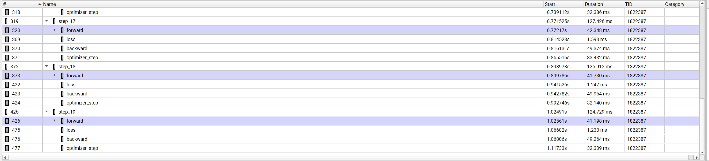
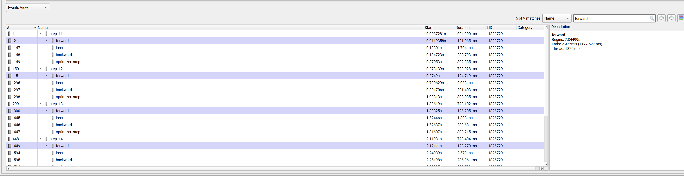
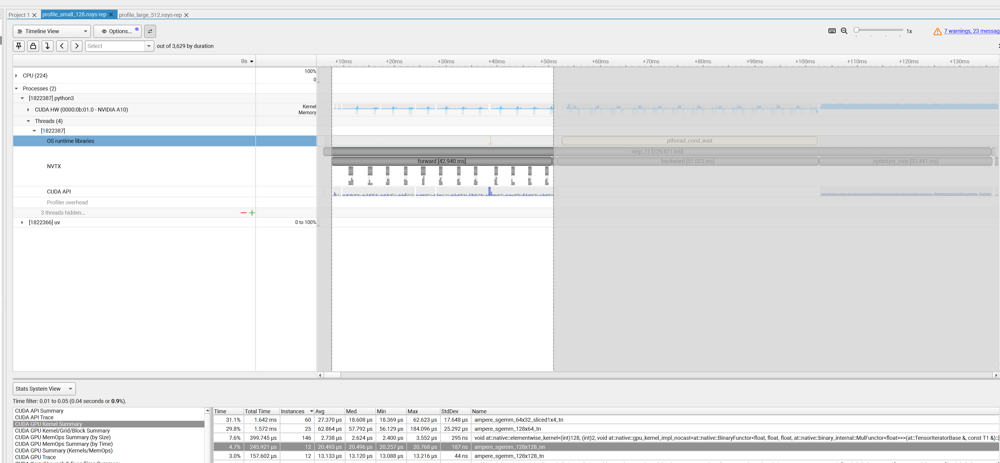
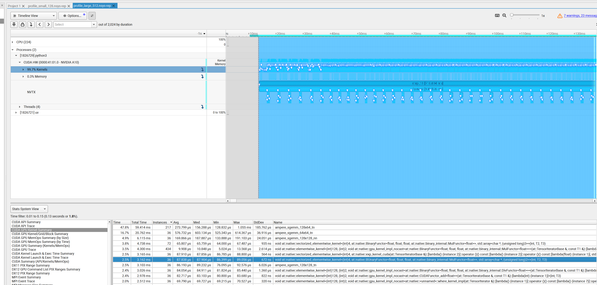
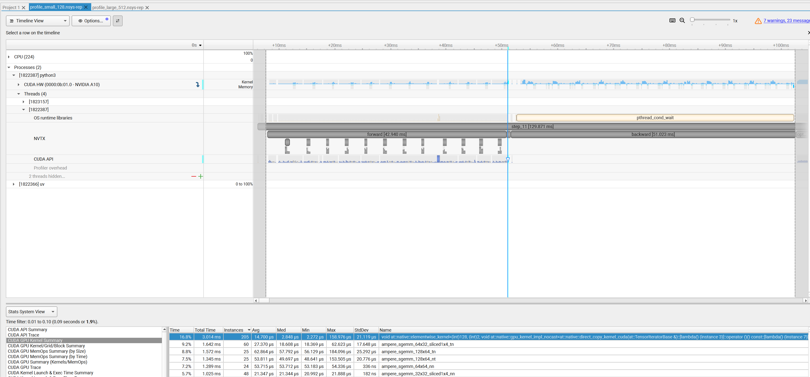

# Assignment Overview

## 1.1 Profiling and Benchmarking

### 1.1.3 End-to-End Benchmarking

A10 can not run 2.7b model for fp32, so I only run up to xl model.

The table use batch size 4 here.

To compare with nsys profiling result, I also run with batch size 1 save in results.

Problem

(b) The standard deviation of the forward and backward times is quite low, which suggests that the measurements are consistent across runs. 
    The backward is calculate by one fw+bw run - another fw run, so the std is higher than fwbw, dueto not pefectly implemented.

warm_up 5 result

| size   |   d_model |   d_ff |   num_layers |   num_heads |   fw_mean_ms |   fw_std_ms |   bw_only_mean_ms |   bw_only_std_ms |   fwbw_mean_ms |   fwbw_std_ms |
|:-------|----------:|-------:|-------------:|------------:|-------------:|------------:|------------------:|-----------------:|---------------:|--------------:|
| small  |       768 |   3072 |           12 |          12 |        35.34 |        0.22 |             70.13 |             0.88 |         103.7  |          1    |
| medium |      1024 |   4096 |           24 |          16 |       108    |        2.75 |            204.64 |             0.93 |         309.73 |          1.21 |
| large  |      1280 |   5120 |           36 |          20 |       233.44 |        2.41 |            465.89 |             0.71 |         697.26 |          1.1  |
| xl     |      1600 |   6400 |           48 |          25 |       488.79 |        2.55 |            929.77 |             3.32 |        1413.81 |          4.36 |

(c) warm_up 0 result has much higher mean and std, which indicates that the first few runs are not stable and have more variability.
    warm_up 1 and warm_up 2 have very little higher mean as warm_up 5, but has several very large std.

warm_up 0 result

| size   |   d_model |   d_ff |   num_layers |   num_heads |   fw_mean_ms |   fw_std_ms |   bw_only_mean_ms |   bw_only_std_ms |   fwbw_mean_ms |   fwbw_std_ms |
|:-------|----------:|-------:|-------------:|------------:|-------------:|------------:|------------------:|-----------------:|---------------:|--------------:|
| small  |       768 |   3072 |           12 |          12 |        75.39 |      126.28 |            103.31 |           102.05 |         137.47 |        102.51 |
| medium |      1024 |   4096 |           24 |          16 |       112.3  |       10.06 |            206.39 |             1.4  |         312.53 |          2.16 |
| large  |      1280 |   5120 |           36 |          20 |       238.05 |       10.7  |            464.32 |             0.81 |         696.07 |          2.1  |
| xl     |      1600 |   6400 |           48 |          25 |       493.9  |        8.82 |            993.3  |            91.47 |        1478.1  |         89.88 |

warm_up 1 result

| size   |   d_model |   d_ff |   num_layers |   num_heads |   fw_mean_ms |   fw_std_ms |   bw_only_mean_ms |   bw_only_std_ms |   fwbw_mean_ms |   fwbw_std_ms |
|:-------|----------:|-------:|-------------:|------------:|-------------:|------------:|------------------:|-----------------:|---------------:|--------------:|
| small  |       768 |   3072 |           12 |          12 |        35.27 |        0.94 |             70.72 |             0.86 |         104.55 |          1.49 |
| medium |      1024 |   4096 |           24 |          16 |       108.6  |        1.55 |            206.71 |             0.28 |         313.23 |          0.87 |
| large  |      1280 |   5120 |           36 |          20 |       238.33 |        3.89 |            462.93 |             0.61 |         693.76 |          1.58 |
| xl     |      1600 |   6400 |           48 |          25 |       490.5  |        6.5  |            953.97 |            32.71 |        1438.3  |         30.24 |

warm_up 2 result

| size   |   d_model |   d_ff |   num_layers |   num_heads |   fw_mean_ms |   fw_std_ms |   bw_only_mean_ms |   bw_only_std_ms |   fwbw_mean_ms |   fwbw_std_ms |
|:-------|----------:|-------:|-------------:|------------:|-------------:|------------:|------------------:|-----------------:|---------------:|--------------:|
| small  |       768 |   3072 |           12 |          12 |        35.69 |        0.4  |             71.16 |             0.64 |         105.38 |          1.06 |
| medium |      1024 |   4096 |           24 |          16 |       109.61 |        1.98 |            206.41 |             1.01 |         312.57 |          1.35 |
| large  |      1280 |   5120 |           36 |          20 |       235.73 |        3.75 |            464.8  |             1.11 |         697.23 |          2.04 |
| xl     |      1600 |   6400 |           48 |          25 |       490.94 |        4.54 |            951.92 |            18.38 |        1442.1  |         21.63 |

### 1.1.4 PyTorch Nsight Systems Profiling

(a) What is the total time spent on your forward pass? Does it match what we had measured before
with the Python standard library?

benchmark small fw 29.08 ± 0.05 ms

benchmark large fw 86.10 ± 1.24 ms

profile small fw near 41ms



profile large fw near 125ms



profile fw time is a bit longer than benchmark fw time, because the profiler adds some overhead to collect data.

(b) What CUDA kernel takes the most cumulative GPU time during the forward pass? How many times is this kernel invoked during a single forward pass of your model? Is it the same kernel that takes the most runtime when you do both forward and backward passes? (Hint: look at the “CUDA GPU Kernel Summary” under “Stats Systems View”, and filter using NVTX ranges to identify which parts of the model are responsible for which kernels.)

for small model, the kernel that takes the most cumulative GPU time during the forward pass is ampere_sgemm_64x32_sliced1x4_tn



for large model, most fw is ampere_sgemm_128x64_tn



for small model,  the kernel that takes the most cumulative GPU time during and fw + bw  is 

void at::native::elementwise_kernel<(int)128, (int)2, void at::native::gpu_kernel_impl_nocast<at::native::direct_copy_kernel_cuda(at::TensorIteratorBase &)::[lambda() (instance 3)]::operator ()() const::[lambda() (instance 7)]::operator ()() const::[lambda(float) (instance 1)]>(at::TensorIteratorBase &, const T1 &)::[lambda(int) (instance 1)]>(int, T3)



(c) Although the vast majority of FLOPs take place in matrix multiplications, you will notice that several other kernels still take a non-trivial amount of the overall runtime. What other kernels besides matrix multiplies do you see accounting for non-trivial CUDA runtime in the forward pass?

for large model context len 256 fw, we get table below

most of the non-matrix-multiply kernels are elementwise operations in pytorch aten, which are likely from softmax, SwiGLU, RMSNorm, RoPE.

| Time | Total Time | Instances | Avg | Med | Min | Max | StdDev | Name |
| :--- | :--- | :--- | :--- | :--- | :--- | :--- | :--- | :--- |
| 47.8% | 59.414 ms | 217 | 273.799 μs | 156.288 μs | 128.832 μs | 1.055 ms | 185.762 μs | `ampere_sgemm_128x64_tn` |
| 16.7% | 20.762 ms | 36 | 576.732 μs | 603.134 μs | 525.343 μs | 614.367 μs | 36.916 μs | `ampere_sgemm_64x64_tn` |
| 4.9% | 6.115 ms | 36 | 169.866 μs | 187.887 μs | 133.888 μs | 191.103 μs | 24.051 μs | `ampere_sgemm_128x128_nn` |
| 3.8% | 4.738 ms | 72 | 65.807 μs | 65.759 μs | 64.000 μs | 67.487 μs | 935 ns | `void at::native::vectorized_elementwise_kernel<(int)4, at::native::BinaryFunctor<float, float, float, at::native::binary_internal::MulFunctor<float>>, std::array<char *, (unsigned long)3>>(int, T2, T3)` |
| 3.5% | 4.300 ms | 434 | 9.908 μs | 10.848 μs | 5.024 μs | 13.568 μs | 2.614 μs | `void at::native::elementwise_kernel<(int)128, (int)2, void at::native::gpu_kernel_impl_nocast<at::native::BinaryFunctor<float, float, float, at::native::binary_internal::MulFunctor<float>>>(at::TensorIteratorBase &, const T1 &)::[lambda(int) (instance 1)]>(int, T3)` |
| 2.5% | 3.165 ms | 36 | 87.910 μs | 87.856 μs | 86.785 μs | 88.800 μs | 564 ns | `void at::native::vectorized_elementwise_kernel<(int)4, at::native::exp_kernel_cuda(at::TensorIteratorBase &)::[lambda() (instance 2)]::operator ()() const::[lambda() (instance 2)]::operator ()() const::[lambda(float) (instance 1)], std::array<char *, (unsigned long)2>>(int, T2, T3)` |
| 2.5% | 3.162 ms | 36 | 87.838 μs | 87.904 μs | 86.399 μs | 89.056 μs | 672 ns | `void at::native::vectorized_elementwise_kernel<(int)4, at::native::BUnaryFunctor<float, float, float, at::native::binary_internal::MulFunctor<float>>, std::array<char *, (unsigned long)2>>(int, T2, T3)` |

(d) Profile running one complete training step with your implementation of AdamW (i.e., the forward pass, computing the loss and running a backward pass, and finally an optimizer step, as you’d do during training). How does the fraction of time spent on matrix multiplication change, compared to doing inference (forward pass only)? How about other kernels?

The fraction of time spent on matrix multiplication goes down, and the fraction of time spent on elementwise kernel goes up.

The most time consuming kernel is CUDAFunctor_add which is an element-wise add kernerl for paramter update by optimizer.

Some cutlass shows up, which use cuda core and not the official ampere_sgemm which use tensor core. Don't know why, maybe the backward matrix size is not suitable for tensor core.

| Time | Total Time | Instances | Avg | Med | Min | Max | StdDev | Name |
| :--- | :--- | :--- | :--- | :--- | :--- | :--- | :--- | :--- |
| 15.8% | 110.277 ms | 1993 | 55.332 μs | 41.471 μs | 1.407 μs | 318.624 μs | 63.217 μs | `void at::native::vectorized_elementwise_kernel<(int)4, at::native::CUDAFunctor_add<float>, std::array<char *, (unsigned long)3>>(int, T2, T3)` |
| 14.1% | 98.569 ms | 2108 | 46.759 μs | 28.096 μs | 1.344 μs | 211.935 μs | 45.192 μs | `void at::native::vectorized_elementwise_kernel<(int)4, at::native::AUnaryFunctor<float, float, float, at::native::binary_internal::MulFunctor<float>>, std::array<char *, (unsigned long)2>>(int, T2, T3)` |
| 8.5% | 59.414 ms | 217 | 273.799 μs | 156.288 μs | 128.832 μs | 1.055 ms | 185.762 μs | `ampere_sgemm_128x64_tn` |
| 7.8% | 54.392 ms | 73 | 745.091 μs | 730.206 μs | 720.766 μs | 1.021 ms | 40.222 μs | `void cutlass::Kernel2<cutlass_80_simt_sgemm_256x128_8x4_nn_align1>(T1::Params)` |
| 5.6% | 38.865 ms | 180 | 215.919 μs | 144.063 μs | 141.472 μs | 538.046 μs | 141.809 μs | `ampere_sgemm_128x64_nn` |
| 4.7% | 33.060 ms | 73 | 452.883 μs | 440.734 μs | 435.712 μs | 876.094 μs | 51.827 μs | `void cutlass::Kernel2<cutlass_80_simt_sgemm_128x64_8x5_nt_align1>(T1::Params)` |
| 4.4% | 30.909 ms | 613 | 50.423 μs | 13.728 μs | 5.280 μs | 362.719 μs | 66.598 μs | `void at::native::elementwise_kernel<(int)128, (int)2, void at::native::gpu_kernel_impl_nocast<at::native::direct_copy_kernel_cuda(at::TensorIteratorBase &)::[lambda() (instance 3)]::operator ()() const::[lambda() (instance 7)]::operator ()() const::[lambda(float) (instance 1)]>(at::TensorIteratorBase &, const T1 &)::[lambda(int) (instance 1)]>(int, T3)` |

(e) Compare the runtime of the softmax operation versus the matrix multiplication operations within the self-attention layer of your model during a forward pass. How does the difference in runtimes compare to the difference in FLOPs?

The runtime for softmax is double that of matrix multiplication, even though the FLOPs for softmax is much lower than matrix multiplication.


**FLOPS:**

large model has d_model=1280, d_ff=5120, num_heads=20, seq_len=256, d_k=d_model/num_heads=64

softmax = seq_len * 5 (max, sub, exp, sum, div) * batch = 256 * 5 * 1 = 1280.

attention_scores = 2(sum and add) * batch * heads * seq_len * seq_len * d_k = 2 * 1 * 20 * 256 * 256 * 64 = 168M.

**Memory:**

softmax read 4 wirte 3

attention_scores read 1 write 1

### 1.1.5 Mixed Precision

Problem (mixed_precision_accumulation)

```python

import torch


s = torch.tensor(0, dtype=torch.float32)
for i in range(1000):
    s += torch.tensor(0.01,dtype=torch.float32)
print(s, s.dtype)
# tensor(10.0001) torch.float32

s = torch.tensor(0, dtype=torch.float16)
for i in range(1000):
    s += torch.tensor(0.01,dtype=torch.float16)
print(s, s.dtype)
# tensor(9.9531, dtype=torch.float16) torch.float16

s = torch.tensor(0, dtype=torch.float32)
for i in range(1000):
    # this step autocast 0.01 from float16 to float32 (auto lower to upper), so the result is same as below manual cast.
    s += torch.tensor(0.01,dtype=torch.float16)
print(s, s.dtype)
# tensor(10.0021) torch.float32

s = torch.tensor(0, dtype=torch.float32)
for i in range(1000):
    x = torch.tensor(0.01, dtype=torch.float16)
    s += x.type(torch.float32)
print(s, s.dtype)
# tensor(10.0021) torch.float32


# tensor(10.0001) torch.float32
# tensor(9.9531, dtype=torch.float16) torch.float16
# tensor(10.0021) torch.float32
# tensor(10.0021) torch.float32
```

假设我们用 **FP16**（尾数只有 10 位）。
我们要算：$1000 + 0.01$。

1.  **1000 (二进制)**：$1111101000 \approx 1.111101000 \times 2^9$
2.  **0.01 (二进制)**：$\approx 1.01000... \times 2^{-7}$

注意，一个指数是 9，一个是 -7，相差 **16**。

**对阶过程：**
为了把它们加起来，必须把小数的指数也变成 $2^9$。
$1.01... \times 2^{-7} \rightarrow 0.000000000000000101... \times 2^9$
(小数点向左移了16位)

**尾数相加：**
FP16 的尾数只有 **10位** 坑位。
当你把 0.01 的小数点左移 16 位后，它的有效数字早就移出这 10 个坑位的范围了（变成了 0.000...）。

**结果：**
$1.111101000$ (这是1000的尾数)
$+$
$0.000000000$ (这是0.01移位后剩下的尾数，有效位全丢了)
$=$
$1.111101000$ (还是1000)