# Assignment Overview

## 1.1 Profiling and Benchmarking

### 1.1.3 End-to-End Benchmarking

A10 can not run 2.7b model for fp32, so I only run up to xl model.

The table use batch size 4 here.

To compare with nsys profiling result, I also run with batch size 1 save in results.

Problem

(b) The standard deviation of the forward and backward times is quite low, which suggests that the measurements are consistent across runs. 

    Note: The forward dose not use with torch.no_grad(), and for both fw and bw, there are no optimizer step.

warm_up 5 result fp32 precision

| size   |   d_model |   d_ff |   num_layers |   num_heads |   fw_mean_ms |   fw_std_ms |   bw_only_mean_ms |   bw_only_std_ms |   fwbw_mean_ms |   fwbw_std_ms |
|:-------|----------:|-------:|-------------:|------------:|-------------:|------------:|------------------:|-----------------:|---------------:|--------------:|
| small  |       768 |   3072 |           12 |          12 |        35.34 |        0.22 |             70.13 |             0.88 |         103.7  |          1    |
| medium |      1024 |   4096 |           24 |          16 |       108    |        2.75 |            204.64 |             0.93 |         309.73 |          1.21 |
| large  |      1280 |   5120 |           36 |          20 |       233.44 |        2.41 |            465.89 |             0.71 |         697.26 |          1.1  |
| xl     |      1600 |   6400 |           48 |          25 |       488.79 |        2.55 |            929.77 |             3.32 |        1413.81 |          4.36 |

warm_up 5 result bf16 precision, larger model get larger acclerate, from 2 to 3.

| size   |   d_model |   d_ff |   num_layers |   num_heads |   fw_mean_ms |   fw_std_ms |   bw_only_mean_ms |   bw_only_std_ms |   fwbw_mean_ms |   fwbw_std_ms |
|:-------|----------:|-------:|-------------:|------------:|-------------:|------------:|------------------:|-----------------:|---------------:|--------------:|
| small  |       768 |   3072 |           12 |          12 |        32.26 |        0.07 |             32.87 |             0.08 |          64.84 |          0.1  |
| medium |      1024 |   4096 |           24 |          16 |        64.52 |        0.97 |             93.85 |             0.16 |         157.87 |          0.33 |
| large  |      1280 |   5120 |           36 |          20 |       100.66 |        0.71 |            203.52 |             0.31 |         302.78 |          0.73 |
| xl     |      1600 |   6400 |           48 |          25 |       177.53 |        1.08 |            377.39 |             0.78 |         548.89 |          1.19 |

(c) warm_up 0 result has much higher mean and std, which indicates that the first few runs are not stable and have more variability.
    warm_up 1 and warm_up 2 have very little higher mean as warm_up 5, but has several very large std.

below all use fp32 precision.

warm_up 0 result

| size   |   d_model |   d_ff |   num_layers |   num_heads |   fw_mean_ms |   fw_std_ms |   bw_only_mean_ms |   bw_only_std_ms |   fwbw_mean_ms |   fwbw_std_ms |
|:-------|----------:|-------:|-------------:|------------:|-------------:|------------:|------------------:|-----------------:|---------------:|--------------:|
| small  |       768 |   3072 |           12 |          12 |        75.39 |      126.28 |            103.31 |           102.05 |         137.47 |        102.51 |
| medium |      1024 |   4096 |           24 |          16 |       112.3  |       10.06 |            206.39 |             1.4  |         312.53 |          2.16 |
| large  |      1280 |   5120 |           36 |          20 |       238.05 |       10.7  |            464.32 |             0.81 |         696.07 |          2.1  |
| xl     |      1600 |   6400 |           48 |          25 |       493.9  |        8.82 |            993.3  |            91.47 |        1478.1  |         89.88 |

warm_up 1 result

| size   |   d_model |   d_ff |   num_layers |   num_heads |   fw_mean_ms |   fw_std_ms |   bw_only_mean_ms |   bw_only_std_ms |   fwbw_mean_ms |   fwbw_std_ms |
|:-------|----------:|-------:|-------------:|------------:|-------------:|------------:|------------------:|-----------------:|---------------:|--------------:|
| small  |       768 |   3072 |           12 |          12 |        35.27 |        0.94 |             70.72 |             0.86 |         104.55 |          1.49 |
| medium |      1024 |   4096 |           24 |          16 |       108.6  |        1.55 |            206.71 |             0.28 |         313.23 |          0.87 |
| large  |      1280 |   5120 |           36 |          20 |       238.33 |        3.89 |            462.93 |             0.61 |         693.76 |          1.58 |
| xl     |      1600 |   6400 |           48 |          25 |       490.5  |        6.5  |            953.97 |            32.71 |        1438.3  |         30.24 |

warm_up 2 result

| size   |   d_model |   d_ff |   num_layers |   num_heads |   fw_mean_ms |   fw_std_ms |   bw_only_mean_ms |   bw_only_std_ms |   fwbw_mean_ms |   fwbw_std_ms |
|:-------|----------:|-------:|-------------:|------------:|-------------:|------------:|------------------:|-----------------:|---------------:|--------------:|
| small  |       768 |   3072 |           12 |          12 |        35.69 |        0.4  |             71.16 |             0.64 |         105.38 |          1.06 |
| medium |      1024 |   4096 |           24 |          16 |       109.61 |        1.98 |            206.41 |             1.01 |         312.57 |          1.35 |
| large  |      1280 |   5120 |           36 |          20 |       235.73 |        3.75 |            464.8  |             1.11 |         697.23 |          2.04 |
| xl     |      1600 |   6400 |           48 |          25 |       490.94 |        4.54 |            951.92 |            18.38 |        1442.1  |         21.63 |

### 1.1.4 PyTorch Nsight Systems Profiling

(a) What is the total time spent on your forward pass? Does it match what we had measured before
with the Python standard library?

NOTE: we use all fp32 precision here, and batch size=1 for nsight profiling

benchmark small fw 29.08 ± 0.05 ms (batch size 1, note in 1.1.3 we use batch size 4)

benchmark large fw 86.10 ± 1.24 ms (batch size 1, note in 1.1.3 we use batch size 4)

profile small fw near 41ms

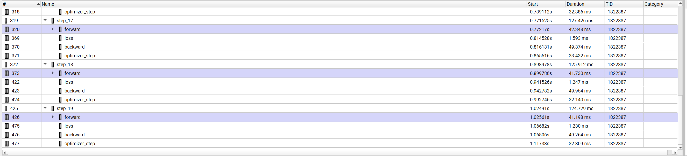

profile large fw near 125ms

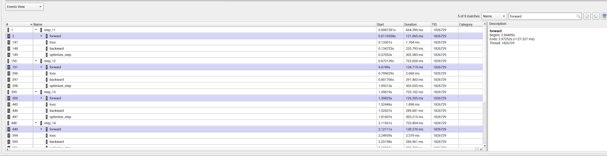

profile fw time is a bit longer than benchmark fw time, because the profiler adds some overhead to collect data.

(b) What CUDA kernel takes the most cumulative GPU time during the forward pass? How many times is this kernel invoked during a single forward pass of your model? Is it the same kernel that takes the most runtime when you do both forward and backward passes? (Hint: look at the “CUDA GPU Kernel Summary” under “Stats Systems View”, and filter using NVTX ranges to identify which parts of the model are responsible for which kernels.)

for small model, the kernel that takes the most cumulative GPU time during the forward pass is ampere_sgemm_64x32_sliced1x4_tn

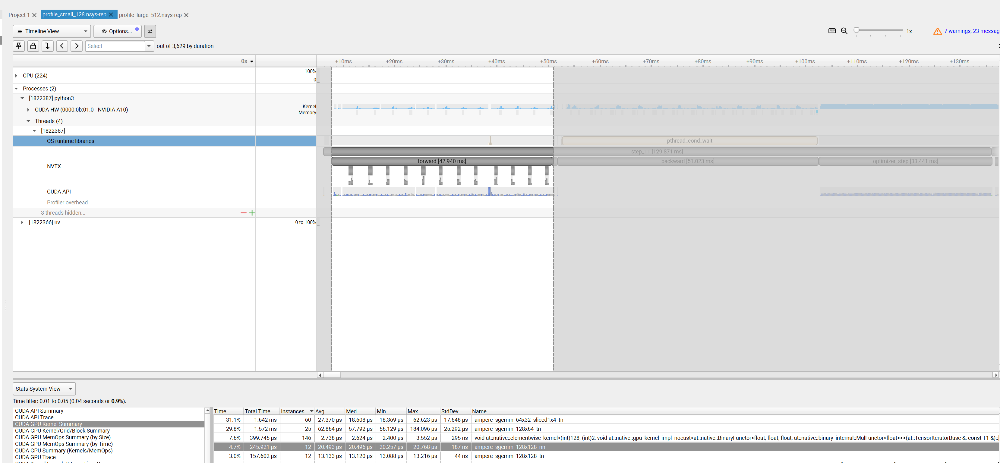

for large model, most fw is ampere_sgemm_128x64_tn

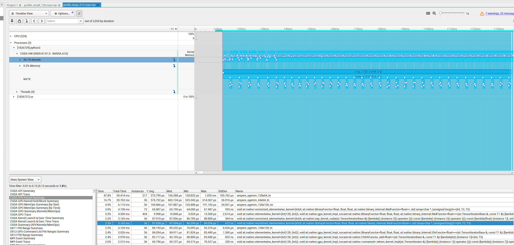

for small model,  the kernel that takes the most cumulative GPU time during and fw + bw  is 

void at::native::elementwise_kernel<(int)128, (int)2, void at::native::gpu_kernel_impl_nocast<at::native::direct_copy_kernel_cuda(at::TensorIteratorBase &)::[lambda() (instance 3)]::operator ()() const::[lambda() (instance 7)]::operator ()() const::[lambda(float) (instance 1)]>(at::TensorIteratorBase &, const T1 &)::[lambda(int) (instance 1)]>(int, T3)

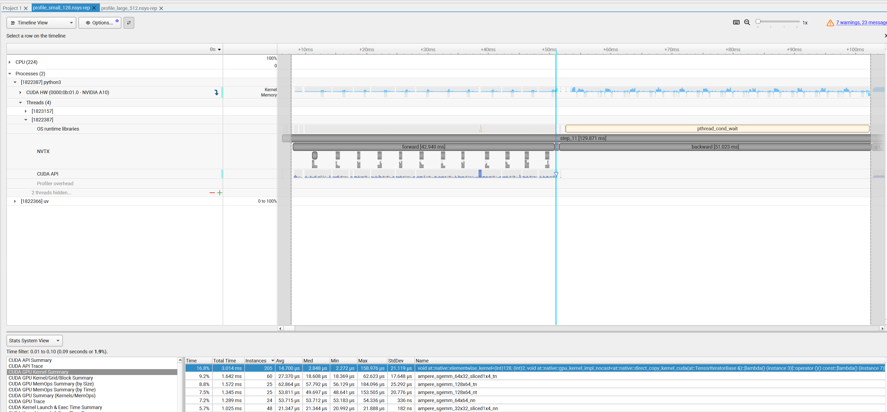

(c) Although the vast majority of FLOPs take place in matrix multiplications, you will notice that several other kernels still take a non-trivial amount of the overall runtime. What other kernels besides matrix multiplies do you see accounting for non-trivial CUDA runtime in the forward pass?

for large model context len 256 fw, we get table below

most of the non-matrix-multiply kernels are elementwise operations in pytorch aten, which are likely from softmax, SwiGLU, RMSNorm, RoPE.

| Time | Total Time | Instances | Avg | Med | Min | Max | StdDev | Name |
| :--- | :--- | :--- | :--- | :--- | :--- | :--- | :--- | :--- |
| 47.8% | 59.414 ms | 217 | 273.799 μs | 156.288 μs | 128.832 μs | 1.055 ms | 185.762 μs | `ampere_sgemm_128x64_tn` |
| 16.7% | 20.762 ms | 36 | 576.732 μs | 603.134 μs | 525.343 μs | 614.367 μs | 36.916 μs | `ampere_sgemm_64x64_tn` |
| 4.9% | 6.115 ms | 36 | 169.866 μs | 187.887 μs | 133.888 μs | 191.103 μs | 24.051 μs | `ampere_sgemm_128x128_nn` |
| 3.8% | 4.738 ms | 72 | 65.807 μs | 65.759 μs | 64.000 μs | 67.487 μs | 935 ns | `void at::native::vectorized_elementwise_kernel<(int)4, at::native::BinaryFunctor<float, float, float, at::native::binary_internal::MulFunctor<float>>, std::array<char *, (unsigned long)3>>(int, T2, T3)` |
| 3.5% | 4.300 ms | 434 | 9.908 μs | 10.848 μs | 5.024 μs | 13.568 μs | 2.614 μs | `void at::native::elementwise_kernel<(int)128, (int)2, void at::native::gpu_kernel_impl_nocast<at::native::BinaryFunctor<float, float, float, at::native::binary_internal::MulFunctor<float>>>(at::TensorIteratorBase &, const T1 &)::[lambda(int) (instance 1)]>(int, T3)` |
| 2.5% | 3.165 ms | 36 | 87.910 μs | 87.856 μs | 86.785 μs | 88.800 μs | 564 ns | `void at::native::vectorized_elementwise_kernel<(int)4, at::native::exp_kernel_cuda(at::TensorIteratorBase &)::[lambda() (instance 2)]::operator ()() const::[lambda() (instance 2)]::operator ()() const::[lambda(float) (instance 1)], std::array<char *, (unsigned long)2>>(int, T2, T3)` |
| 2.5% | 3.162 ms | 36 | 87.838 μs | 87.904 μs | 86.399 μs | 89.056 μs | 672 ns | `void at::native::vectorized_elementwise_kernel<(int)4, at::native::BUnaryFunctor<float, float, float, at::native::binary_internal::MulFunctor<float>>, std::array<char *, (unsigned long)2>>(int, T2, T3)` |

(d) Profile running one complete training step with your implementation of AdamW (i.e., the forward pass, computing the loss and running a backward pass, and finally an optimizer step, as you’d do during training). How does the fraction of time spent on matrix multiplication change, compared to doing inference (forward pass only)? How about other kernels?

The fraction of time spent on matrix multiplication goes down, and the fraction of time spent on elementwise kernel goes up.

The most time consuming kernel is CUDAFunctor_add which is an element-wise add kernerl for paramter update by optimizer.

Some cutlass shows up, which use cuda core and not the official ampere_sgemm which use tensor core. Don't know why, maybe the backward matrix size is not suitable for tensor core.

| Time | Total Time | Instances | Avg | Med | Min | Max | StdDev | Name |
| :--- | :--- | :--- | :--- | :--- | :--- | :--- | :--- | :--- |
| 15.8% | 110.277 ms | 1993 | 55.332 μs | 41.471 μs | 1.407 μs | 318.624 μs | 63.217 μs | `void at::native::vectorized_elementwise_kernel<(int)4, at::native::CUDAFunctor_add<float>, std::array<char *, (unsigned long)3>>(int, T2, T3)` |
| 14.1% | 98.569 ms | 2108 | 46.759 μs | 28.096 μs | 1.344 μs | 211.935 μs | 45.192 μs | `void at::native::vectorized_elementwise_kernel<(int)4, at::native::AUnaryFunctor<float, float, float, at::native::binary_internal::MulFunctor<float>>, std::array<char *, (unsigned long)2>>(int, T2, T3)` |
| 8.5% | 59.414 ms | 217 | 273.799 μs | 156.288 μs | 128.832 μs | 1.055 ms | 185.762 μs | `ampere_sgemm_128x64_tn` |
| 7.8% | 54.392 ms | 73 | 745.091 μs | 730.206 μs | 720.766 μs | 1.021 ms | 40.222 μs | `void cutlass::Kernel2<cutlass_80_simt_sgemm_256x128_8x4_nn_align1>(T1::Params)` |
| 5.6% | 38.865 ms | 180 | 215.919 μs | 144.063 μs | 141.472 μs | 538.046 μs | 141.809 μs | `ampere_sgemm_128x64_nn` |
| 4.7% | 33.060 ms | 73 | 452.883 μs | 440.734 μs | 435.712 μs | 876.094 μs | 51.827 μs | `void cutlass::Kernel2<cutlass_80_simt_sgemm_128x64_8x5_nt_align1>(T1::Params)` |
| 4.4% | 30.909 ms | 613 | 50.423 μs | 13.728 μs | 5.280 μs | 362.719 μs | 66.598 μs | `void at::native::elementwise_kernel<(int)128, (int)2, void at::native::gpu_kernel_impl_nocast<at::native::direct_copy_kernel_cuda(at::TensorIteratorBase &)::[lambda() (instance 3)]::operator ()() const::[lambda() (instance 7)]::operator ()() const::[lambda(float) (instance 1)]>(at::TensorIteratorBase &, const T1 &)::[lambda(int) (instance 1)]>(int, T3)` |

(e) Compare the runtime of the softmax operation versus the matrix multiplication operations within the self-attention layer of your model during a forward pass. How does the difference in runtimes compare to the difference in FLOPs?

The runtime for softmax is double that of matrix multiplication, even though the FLOPs for softmax is much lower than matrix multiplication.

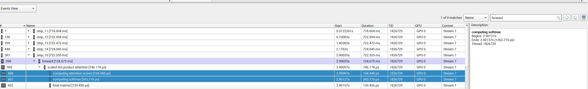

**FLOPS:**

large model has d_model=1280, d_ff=5120, num_heads=20, seq_len=256, d_k=d_model/num_heads=64

softmax = seq_len * 5 (max, sub, exp, sum, div) * batch = 256 * 5 * 1 = 1280.

attention_scores = 2(sum and add) * batch * heads * seq_len * seq_len * d_k = 2 * 1 * 20 * 256 * 256 * 64 = 168M.

**Memory:**

softmax read 4 wirte 3

attention_scores read 1 write 1

### 1.1.5 Mixed Precision

#### Problem (mixed_precision_accumulation)

```python

import torch


s = torch.tensor(0, dtype=torch.float32)
for i in range(1000):
    s += torch.tensor(0.01,dtype=torch.float32)
print(s, s.dtype)
# tensor(10.0001) torch.float32

s = torch.tensor(0, dtype=torch.float16)
for i in range(1000):
    s += torch.tensor(0.01,dtype=torch.float16)
print(s, s.dtype)
# tensor(9.9531, dtype=torch.float16) torch.float16

s = torch.tensor(0, dtype=torch.float32)
for i in range(1000):
    # this step autocast 0.01 from float16 to float32 (auto lower to upper), so the result is same as below manual cast.
    s += torch.tensor(0.01,dtype=torch.float16)
print(s, s.dtype)
# tensor(10.0021) torch.float32

s = torch.tensor(0, dtype=torch.float32)
for i in range(1000):
    x = torch.tensor(0.01, dtype=torch.float16)
    s += x.type(torch.float32)
print(s, s.dtype)
# tensor(10.0021) torch.float32


# tensor(10.0001) torch.float32
# tensor(9.9531, dtype=torch.float16) torch.float16
# tensor(10.0021) torch.float32
# tensor(10.0021) torch.float32
```

the results not equal 10, fp32 + fp32 is accurate than fp32 + fp16 and than fp16 + fp16.

fp32 + fp16 will autocast the fp16 to fp32 before addition, the result is same as manual cast.

#### Problem (benchmarking_mixed_precision)

(a) ToyModel dtype analyse:

Model parameters dtype in autocast context: torch.float32 for all parameters

input's dtype in autocast context: torch.float32

the output of the first feed-forward layer: torch.float16

the output of layer norm: torch.float32

the model’s predicted logits: torch.float16

the loss (use naive sum as loss): torch.float32

the model's gradient: torch.float32 for all parameters

(b) The parts of layernorm need to be in fp32 because of the precision requirement of the mean and variance calculation, which can be very sensitive to numerical instability.

Use auto cast to cast as bfloat16, the layer norm still need to cast to float32. Because we need more bit for mantissa. Mantisa of bf16 is smaller than fp16, make is worse than fp16.

Model parameters dtype in autocast context: torch.float32 for all parameters

input's dtype in autocast context: torch.float32

the output of the first feed-forward layer: torch.bfloat16

the output of layer norm: torch.float32

the model’s predicted logits:  torch.bfloat16

the loss (use naive sum as loss): torch.float32

the model's gradient: torch.float32 for all parameters

(c) see results in 1.1.3, the speed up is around 2 for small model and around 3 for xl model.

### 1.1.6 Profiling Memory

A10 with 24 Gb can not run backward pass of xl or 2.7B model, so I only run up to large model, with context length 128, 256 and 512, batch size 1.

(a)

below is the memory profile of large model with context length 512, fp32 precision.


**fw with no grad and no optimizer (like inference)**

constant memory for model paramters only.

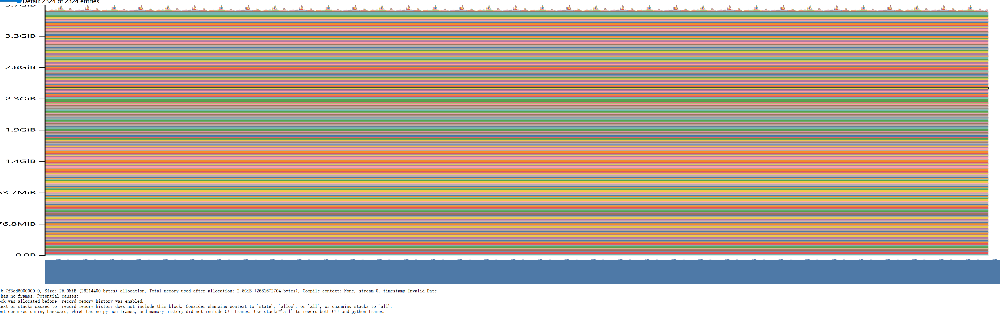

**fw with grad and optimizer**

bottom constant memory for model paramters only.

upper goes up and down are activation.

middlle constant and then goes down is optimizer state.

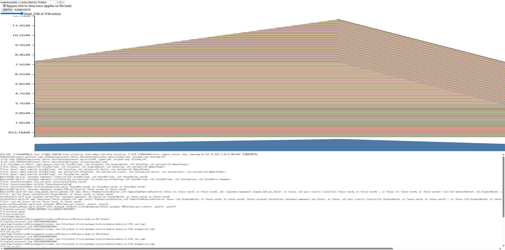

**full train**

the samll spike is zero grad

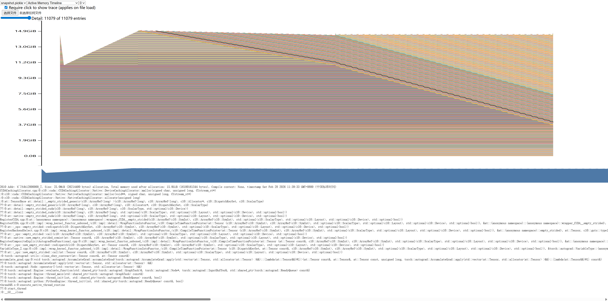

(b)

| Context Length | Forward Only (FW) | Full Train (Train) | 增量 (Train - FW) |
| :--- | :--- | :--- | :--- |
| **128** | 4.7 GB | 14.6 GB | +9.9 GB |
| **256** | 6.5 GB | 14.6 GB | +8.1 GB |
| **512** | 11.2 GB | 14.9 GB | +3.7 GB |

forward the memory usage increases with context length, because the activation size increases with context length.

full train memory keep similar with context length, because memory fragmentation and caching allocator.

try PYTORCH_CUDA_ALLOC_CONF=max_split_size_mb:128 in 128 and 256 setting.

(c) Find the peak memory usage of the 2.7B model when using mixed-precision, for both a forward pass and a full optimizer step. Does mixed-precision significantly affect memory usage?

below is the memory profile of large model with context length 512, bf16 precision.

**fw with no grad and no optimizer (like inference)**

In mixed-precision forward-only mode, torch.autocast caches a BF16 copy of each layer's FP32 weights on first use, causing memory to climb layer-by-layer even under torch.no_grad(); these cached casts are only freed when the autocast context exits. In contrast, pure FP32 forward-only mode involves no dtype conversions, so intermediate tensors are released immediately after each layer, keeping memory flat at roughly the model-weight footprint.

5.4GB = 3.5GB (model parameters) + 1.75GB (BF16 cached weights) + 0.1GB (activations)

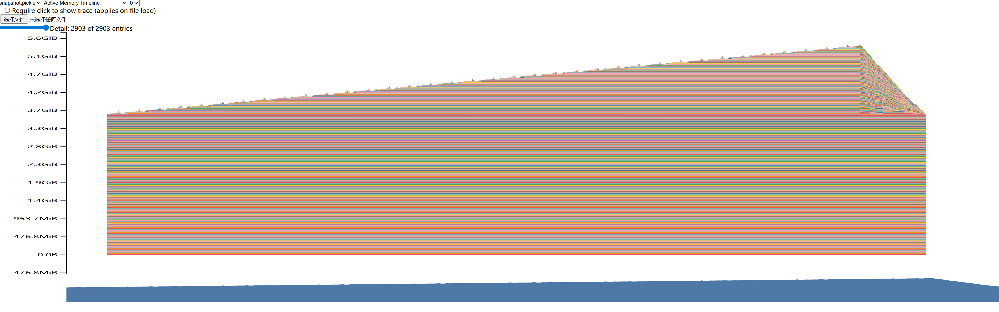

**fw with grad and optimizer**

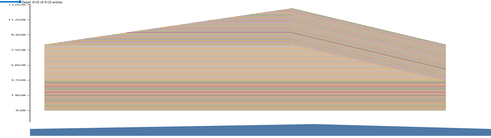

**full train**

torch.autocast only accelerates computation by casting activations to BF16 on the fly, but leaves model weights, gradients, and optimizer states (m, v) in FP32—which together dominate ~80% of training memory—so peak memory is nearly unchanged. The small savings from halved-precision activations are further offset by autocast's cached BF16 weight copies, making mixed-precision full training memory roughly equal to pure FP32 training.

| Component | FP32 | Mixed Precision (autocast) |
| :--- | :--- | :--- |
| Weights (FP32) | 3.07 GiB | 3.07 GiB |
| Gradients (FP32) | 3.07 GiB | 3.07 GiB |
| Optimizer States m,v (FP32) | 6.14 GiB | 6.14 GiB |
| Activations | ~2.5 GiB | ~1.25 GiB (✅ Saved ~1.25 GiB) |
| BF16 Weight Cache | 0 | ~1.54 GiB (❌ Added ~1.54 GiB) |
| **Total** | **~14.8 GiB** | **~15.1 GiB** |

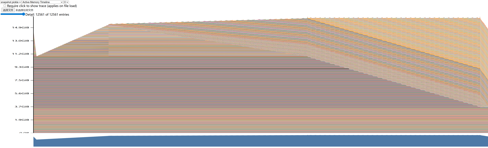

(d) Consider the 2.7B model. At our reference hyperparameters, what is the size of a tensor of activations in the Transformer residual stream, in single-precision? Give this size in MB

1×256×2560x4 / (1024 * 1024) = 2.5 MB

(e)

TODO

## 1.2 Benchmarking pytorch attention

|   d_k |   seq_len |   fw_mean_ms |   fw_std_ms |   fw_grad_mean_ms |   fw_grad_std_ms |   bw_mean_ms |   bw_std_ms |   mem_no_grad_MB |   mem_with_grad_MB |   mem_saved_MB | OOM   |
|------:|----------:|-------------:|------------:|------------------:|-----------------:|-------------:|------------:|-----------------:|-------------------:|---------------:|:------|
|    16 |       256 |        0.265 |       0.011 |             0.377 |            0.012 |        0.632 |       0.013 |            17.19 |              21.21 |           4.02 | False |
|    16 |      1024 |        1.116 |       0.007 |             1.162 |            0.004 |        2.621 |       0.008 |            20.75 |              84.84 |          64.09 | False |
|    16 |      4096 |       16.35  |       0.081 |            16.352 |            0.057 |       38.32  |       0.104 |            46.25 |            1070.62 |        1024.38 | False |
|    16 |      8192 |       65.072 |       0.441 |            65.253 |            0.244 |      152.334 |       0.387 |           108.25 |            4205    |        4096.75 | False |
|    16 |     16384 |      nan     |     nan     |           nan     |          nan     |      nan     |     nan     |           nan    |             nan    |         nan    | True  |
|    32 |       256 |        0.269 |       0.01  |             0.41  |            0.012 |        0.693 |       0.013 |            18.06 |              22.09 |           4.02 | False |
|    32 |      1024 |        1.144 |       0.01  |             1.199 |            0.005 |        2.679 |       0.009 |            24.25 |              88.34 |          64.09 | False |
|    32 |      4096 |       16.806 |       0.105 |            16.794 |            0.08  |       39.086 |       0.13  |            60.25 |            1084.62 |        1024.38 | False |
|    32 |      8192 |       66.848 |       0.47  |            66.875 |            0.142 |      154.78  |       0.33  |           136.25 |            4233    |        4096.75 | False |
|    32 |     16384 |      nan     |     nan     |           nan     |          nan     |      nan     |     nan     |           nan    |             nan    |         nan    | True  |
|    64 |       256 |        0.269 |       0.01  |             0.421 |            0.013 |        0.7   |       0.012 |            19.81 |              23.84 |           4.02 | False |
|    64 |      1024 |        1.183 |       0.013 |             1.236 |            0.006 |        2.726 |       0.008 |            31.25 |              95.34 |          64.09 | False |
|    64 |      4096 |       17.034 |       0.14  |            16.982 |            0.124 |       39.433 |       0.221 |            88.25 |            1112.62 |        1024.38 | False |
|    64 |      8192 |       68.12  |       0.227 |            68.257 |            0.116 |      156.519 |       0.315 |           192.25 |            4289    |        4096.75 | False |
|    64 |     16384 |      nan     |     nan     |           nan     |          nan     |      nan     |     nan     |           nan    |             nan    |         nan    | True  |
|   128 |       256 |        0.268 |       0.009 |             0.42  |            0.013 |        0.687 |       0.013 |            23.31 |              27.34 |           4.02 | False |
|   128 |      1024 |        1.266 |       0.015 |             1.317 |            0.005 |        2.845 |       0.009 |            45.25 |             109.34 |          64.09 | False |
|   128 |      4096 |       18.462 |       0.309 |            18.395 |            0.094 |       41.216 |       0.223 |           144.25 |            1168.62 |        1024.38 | False |
|   128 |      8192 |       73.114 |       1.007 |            73.097 |            0.25  |      165.542 |       1.578 |           304.25 |            4401    |        4096.75 | False |
|   128 |     16384 |      nan     |     nan     |           nan     |          nan     |      nan     |     nan     |           nan    |             nan    |         nan    | True  |
| 128 | 16384 | - | - | - | - | - | - | True |

(1) OOM for any size embed_dim with 16384 context_len

(2) 4 * B * (T * T + T * T) / (1024 * 1024), T * T for attention weight in or before(not sure) for softmax, T * T for attention weight after softmax, 4 for float32, B=8

    for 256 T is 4

    for 8192 T is 4096


(3) How does the memory saved for backward change with the sequence length? What would you do to eliminate this memory cost?

The memory saved for backward increases O(T^2). We could use a fused kernel to compute the attention output in one step, so we don't need to save the intermediate exp in softmax.

## 1.3 Benchmarking JIT-Compiled Attention

(a) Benchmark the forward and backward pass of compiled attention implementation. 

    Use TF32 by torch.set_float32_matmul_precision('high') suggest by torch compile.
    
    Get 2-2.5 times speed up.

origin table

|   d_k |   seq_len |   fw_mean_ms |   fw_std_ms |   fw_grad_mean_ms |   fw_grad_std_ms |   bw_mean_ms |   bw_std_ms |   mem_no_grad_MB |   mem_with_grad_MB |   mem_saved_MB | OOM   |
|------:|----------:|-------------:|------------:|------------------:|-----------------:|-------------:|------------:|-----------------:|-------------------:|---------------:|:------|
|    16 |       256 |        0.142 |       0.009 |             0.318 |            0.01  |        0.483 |       0.014 |            17.19 |              21.22 |           4.03 | False |
|    16 |      1024 |        0.412 |       0.007 |             0.497 |            0.007 |        1.129 |       0.011 |            20.75 |              84.88 |          64.12 | False |
|    16 |      4096 |        5.074 |       0.007 |             6.363 |            0.015 |       13.898 |       0.044 |            46.25 |            1070.75 |        1024.5  | False |
|    16 |      8192 |       23.688 |       0.527 |            29.913 |            0.044 |       55.756 |       0.066 |           108.25 |            4205.25 |        4097    | False |
|    16 |     16384 |      nan     |     nan     |           nan     |          nan     |      nan     |     nan     |           nan    |             nan    |         nan    | True  |
|    32 |       256 |        0.202 |       0.01  |             0.396 |            0.131 |        0.49  |       0.013 |            18.06 |              22.09 |           4.03 | False |
|    32 |      1024 |        0.492 |       0.006 |             0.579 |            0.009 |        1.205 |       0.025 |            24.25 |              88.38 |          64.12 | False |
|    32 |      4096 |        7.947 |       0.034 |             8.073 |            0.045 |       15.779 |       0.055 |            60.25 |            1084.75 |        1024.5  | False |
|    32 |      8192 |       31.674 |       0.477 |            31.824 |            0.062 |       62.56  |       0.127 |           136.25 |            4233.25 |        4097    | False |
|    32 |     16384 |      nan     |     nan     |           nan     |          nan     |      nan     |     nan     |           nan    |             nan    |         nan    | True  |
|    64 |       256 |        0.239 |       0.008 |             0.392 |            0.011 |        0.492 |       0.012 |            19.81 |              23.84 |           4.03 | False |
|    64 |      1024 |        0.692 |       0.022 |             0.609 |            0.015 |        1.318 |       0.077 |            31.25 |              95.38 |          64.12 | False |
|    64 |      4096 |        6.06  |       0.017 |             8.405 |            0.012 |       16.119 |       0.049 |            88.25 |            1112.75 |        1024.5  | False |
|    64 |      8192 |       24.122 |       0.414 |            32.955 |            0.055 |       63.385 |       0.085 |           192.25 |            4289.25 |        4097    | False |
|    64 |     16384 |      nan     |     nan     |           nan     |          nan     |      nan     |     nan     |           nan    |             nan    |         nan    | True  |
|   128 |       256 |        0.236 |       0.01  |             0.388 |            0.011 |        0.492 |       0.013 |            23.31 |              27.34 |           4.03 | False |
|   128 |      1024 |        0.735 |       0.033 |             0.662 |            0.004 |        1.321 |       0.008 |            45.25 |             109.38 |          64.12 | False |
|   128 |      4096 |        6.839 |       0.046 |             9.069 |            0.051 |       17.288 |       0.086 |           144.25 |            1168.75 |        1024.5  | False |
|   128 |      8192 |       27.307 |       0.4   |            35.509 |            0.188 |       68.393 |       0.347 |           304.25 |            4401.25 |        4097    | False |
|   128 |     16384 |      nan     |     nan     |           nan     |          nan     |      nan     |     nan     |           nan    |             nan    |         nan    | True  |

compare table

| d_k | seq_len | fw_grad_base | fw_grad_compile | fw_grad_speedup | bw_base | bw_compile | bw_speedup | mem_base_MB | mem_compile_MB | mem_ratio |
|-----|---------|--------------|-----------------|-----------------|---------|------------|------------|-------------|----------------|-----------|
| 16 | 256 | 0.377 | 0.318 | 1.19 | 0.632 | 0.483 | 1.31 | 21.21 | 21.22 | 1.0005 |
| 16 | 1024 | 1.162 | 0.497 | 2.34 | 2.621 | 1.129 | 2.32 | 84.84 | 84.88 | 1.0005 |
| 16 | 4096 | 16.352 | 6.363 | 2.57 | 38.320 | 13.898 | 2.76 | 1070.62 | 1070.75 | 1.0001 |
| 16 | 8192 | 65.253 | 29.913 | 2.18 | 152.334 | 55.756 | 2.73 | 4205.00 | 4205.25 | 1.0001 |
| 32 | 256 | 0.410 | 0.396 | 1.04 | 0.693 | 0.490 | 1.41 | 22.09 | 22.09 | 1.0000 |
| 32 | 1024 | 1.199 | 0.579 | 2.07 | 2.679 | 1.205 | 2.22 | 88.34 | 88.38 | 1.0005 |
| 32 | 4096 | 16.794 | 8.073 | 2.08 | 39.086 | 15.779 | 2.48 | 1084.62 | 1084.75 | 1.0001 |
| 32 | 8192 | 66.875 | 31.824 | 2.10 | 154.780 | 62.560 | 2.47 | 4233.00 | 4233.25 | 1.0001 |
| 64 | 256 | 0.421 | 0.392 | 1.07 | 0.700 | 0.492 | 1.42 | 23.84 | 23.84 | 1.0000 |
| 64 | 1024 | 1.236 | 0.609 | 2.03 | 2.726 | 1.318 | 2.07 | 95.34 | 95.38 | 1.0004 |
| 64 | 4096 | 16.982 | 8.405 | 2.02 | 39.433 | 16.119 | 2.45 | 1112.62 | 1112.75 | 1.0001 |
| 64 | 8192 | 68.257 | 32.955 | 2.07 | 156.519 | 63.385 | 2.47 | 4289.00 | 4289.25 | 1.0001 |
| 128 | 256 | 0.420 | 0.388 | 1.08 | 0.687 | 0.492 | 1.40 | 27.34 | 27.34 | 1.0000 |
| 128 | 1024 | 1.317 | 0.662 | 1.99 | 2.845 | 1.321 | 2.15 | 109.34 | 109.38 | 1.0004 |
| 128 | 4096 | 18.395 | 9.069 | 2.03 | 41.216 | 17.288 | 2.38 | 1168.62 | 1168.75 | 1.0001 |
| 128 | 8192 | 73.097 | 35.509 | 2.06 | 165.542 | 68.393 | 2.42 | 4401.00 | 4401.25 | 1.0001 |


(b) Benchmark the forward and backward pass of compiled TransformerLM implementation. 

    Note i didn't add optimizer step to keep same as baseline. (the course require add optimizer step here)

    get speedup 1.5-2 times

origin table

| size   |   d_model |   d_ff |   num_layers |   num_heads |   fw_mean_ms |   fw_std_ms |   bw_only_mean_ms |   bw_only_std_ms |   fwbw_mean_ms |   fwbw_std_ms |
|:-------|----------:|-------:|-------------:|------------:|-------------:|------------:|------------------:|-----------------:|---------------:|--------------:|
| small  |       768 |   3072 |           12 |          12 |         9.12 |        0.15 |             18.58 |             0.07 |          27.82 |          0.08 |
| medium |      1024 |   4096 |           24 |          16 |        25.23 |        0.1  |             54.67 |             0.83 |          81.17 |          1.07 |
| large  |      1280 |   5120 |           36 |          20 |        59.9  |        0.43 |            127.32 |             0.92 |         186.83 |          1.48 |
| xl     |      1600 |   6400 |           48 |          25 |       108.4  |        1.25 |            251.69 |             2.02 |         360.22 |          2.3  |

compare table

| size | d_model | num_layers | num_heads | fw_base_ms | fw_compile_ms | fw_speedup | bw_base_ms | bw_compile_ms | bw_speedup | fwbw_base_ms | fwbw_compile_ms | fwbw_speedup |
|------|---------|------------|-----------|------------|---------------|------------|------------|---------------|------------|--------------|-----------------|--------------|
| small | 768 | 12 | 12 | 32.26 | 9.12 | 3.54 | 32.87 | 18.58 | 1.77 | 64.84 | 27.82 | 2.33 |
| medium | 1024 | 24 | 16 | 64.52 | 25.23 | 2.56 | 93.85 | 54.67 | 1.72 | 157.87 | 81.17 | 1.94 |
| large | 1280 | 36 | 20 | 100.66 | 59.90 | 1.68 | 203.52 | 127.32 | 1.60 | 302.78 | 186.83 | 1.62 |
| xl | 1600 | 48 | 25 | 177.53 | 108.40 | 1.64 | 377.39 | 251.69 | 1.50 | 548.89 | 360.22 | 1.52 |